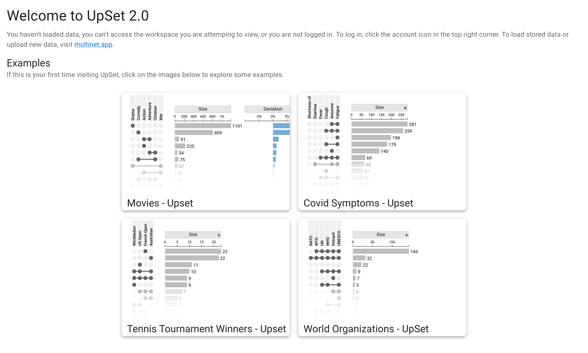

# UpSet 2 on the Web

To use UpSet 2.0 in your web browser, simply navigate to [upset.multinet.app](https://upset.multinet.app).

:::note

Officially, only Google Chrome is supported by UpSet 2.0, but many features are also tested on Firefox and should work.

:::

Upon navigating to the website, you should be met with a homepage which features some example plots. These are pre-configured and act as example/toy datasets which you can use to familiarize yourself with UpSet 2.0's features.

### Using your own data

To use your own data, visit [multinet.app](https://multinet.app) and follow the [Multinet documentation](https://docs.multinet.app/en/latest/user_documentation.html#upload-data).
