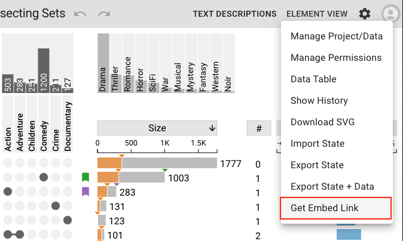
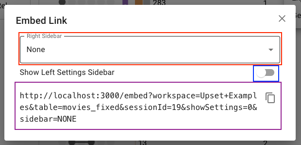
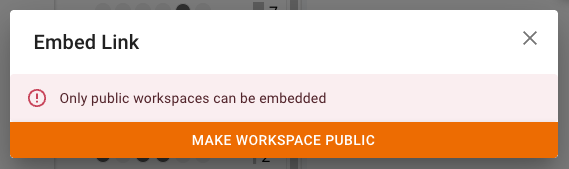

# Embedding Upset

At the bottom of the dropdown menu on the right side of the header is an option labeled *Get Embed Link*.

Clicking on this opens a dialog box allowing you to customize an embed link. This embed link can be placed into the `src` attribute of an `<iframe>` element anywhere on the web to embed your upset plot in another page. Note that even while embedded, Upset plots save and show edits made to them by authorized users, regardless of whether these changes are made in the embedded version or from the Multinet app. Viewers of your embedded plot who do not have permissions to edit it can make temporary local changes, but these are not saved and do not persist when the page is refreshed.

- The **Right Sidebar** dropdown, boxed in red, allows you to choose which sidebar, if any, to display on the right side of the screen: Element View, Text Descriptions, or None for no sidebar displayed. Note that *the right sidebar cannot be closed by the user* in an embedded plot, so select None if your space is limited to avoid covering the plot.
- The **Show Left Settings Sidebar** toggle, boxed in blue, controls whether Settings sidebar, displayed to the left, is shown. This sidebar retains its collapsibility as in the non-embedded app: it can be collapsed to a small button and re-expanded by clicking said button. If this toggle is off, neither the sidebar nor the button to expand it while collapsed are shown, and it becomes impossible for the user to alter the plot's settings other than what's achievable with selections and right-clicks.

To copy the embed link, click anywhere on the link or on the copy button to the right of it (anywhere within the purple boxed area). A green checkmark indicates that the copy was successful; this resets to the copy button after a few seconds or if the link changes.

## Private Workspaces

**Only Upset plots from public Multinet workspaces can be embedded**. If you try to create an embed link for a private workspace, you'll be met with an error:

If you have permission to make the workspace public, a button will appear to do so, which will then enable embedding and display the embed dialog. *Clicking this button immediately makes the workspace public!* If you wish to make the workspace private again in the future, the header's right side dropdown menu contains a *Manage Permissions* option that takes you to a Multinet page allowing you to set the workspace back to private.

