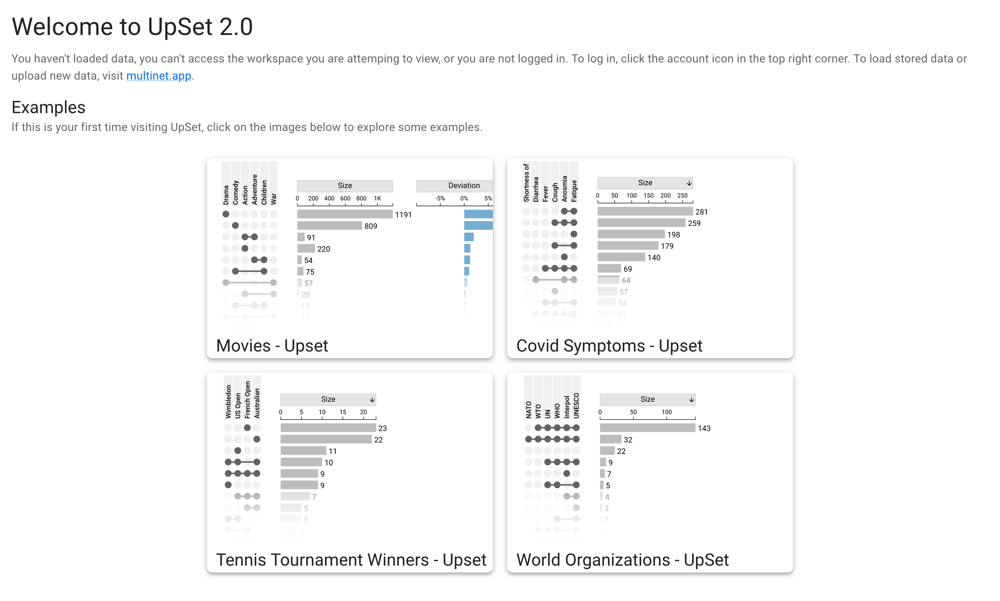
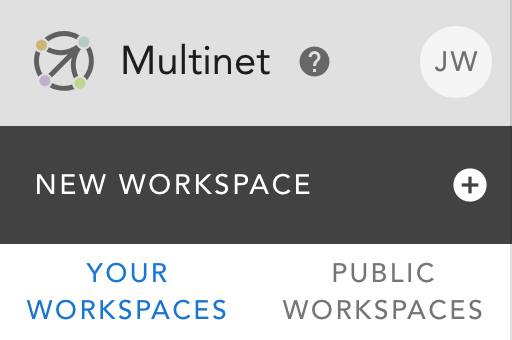
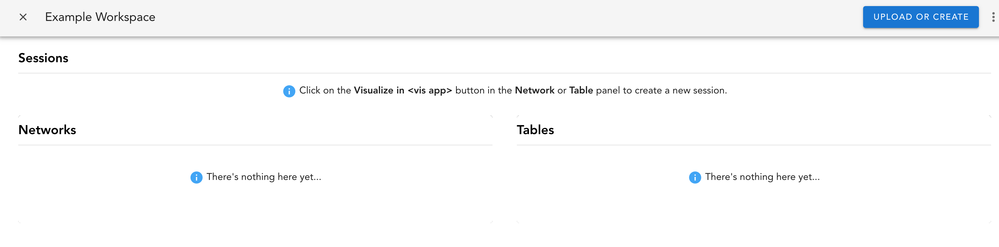
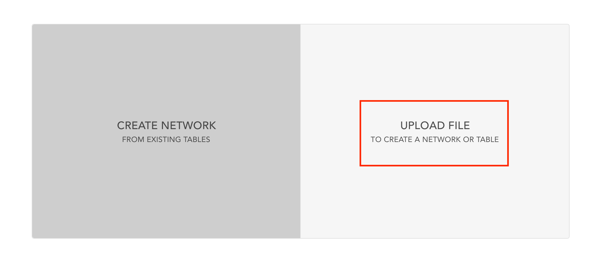
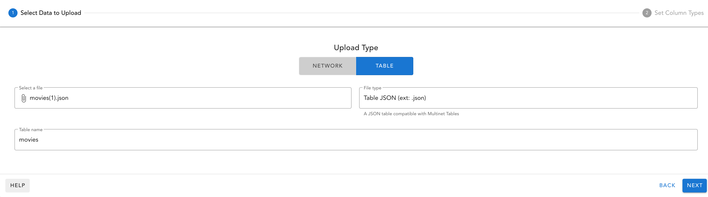
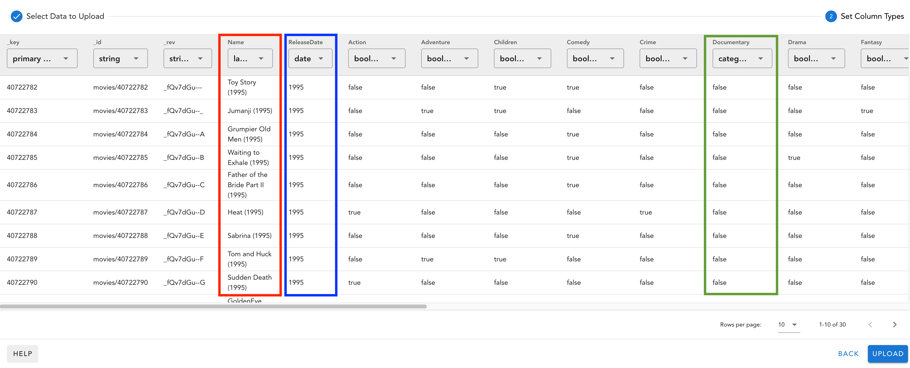
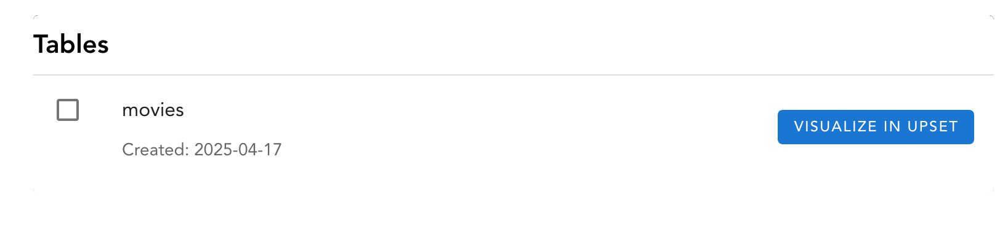

# UpSet 2 on the Web

To use UpSet 2.0 in your web browser, simply navigate to [upset.multinet.app](https://upset.multinet.app).

:::note

Officially, only Google Chrome is supported by UpSet 2.0, but many features are also tested on Firefox and should work.

:::

Upon navigating to the website, you should be met with a homepage which features some example plots. These are pre-configured and act as example/toy datasets which you can use to familiarize yourself with UpSet 2.0's features.

## Using your own data

If you have a dataset that you wish to upload to the UpSet 2 interactive website, you must use the [Multinet App](https://multinet.app).

To upload data, you must create an account or log in if you already have one. For information on the specifics of this process, see the [Multinet user documentation](https://docs.multinet.app/en/latest/user_documentation.html#log-in).

### Creating a workspace

Tables must be uploaded to a workspace in Multinet. To create a new workspace, use the left sidebar.

There's two types of workspaces, public, and private. Public workspaces are accessible to any users. Ensure that if you are uploading any sensitive or private data, you create a personal, private workspace.

### Upload a New Table

Within your workspace, use the "Upload or Create" button in the top navbar to upload your data.

This will open a modal for uploading networks or tables.

>_*NOTE*_: UpSet data MUST be uploaded as a table.

Once you select table upload, a sub-interface will open. Here, fill out all relevant fields and select a JSON or CSV file to upload. This file should contain set membership data and any numeric attribute data.

#### Select Column Types

After clicking next, the table upload interface will change into column type selections.

>_*NOTE*_: Multinet will automatically interpret most column types, but some data present difficulties and can be misinterpreted. It is important that you check each column to ensure type correctness.

In the above screenshot, the movies dataset contains a few different important fields to note.

Annotated red, the "name" column indicates the name of the data entry. This column type should always be set to `label`. This field is used internally for categorization and in the [element view table](../../upset2-features/element-view/element-table.md).

Annotated blue, the "ReleaseDate" column indicates a [dataset attribute](../../upset2-features/attributes/dataset.md). This specific attribute is a date, so the column type is set to `Date`. These are also commonly `Number` type (ex: Average Rating).

Annotated green, the "Documentary" column shows as `category` type. Since this column is actually a boolean column, this appears to be mislabelled. It is important to adjust the type to `boolean` so that the data is properly processed during the upload.

Once the data types have been checked and adjusted if necessary, click "Upload" to begin the processing and upload process.

#### Open the table in UpSet

Once the upload process is complete, the table will be added to the list of tables in the workspace. To the right of the table name, click the button "Visualize in UpSet" to open the dataset in the interactive UpSet 2 application.

