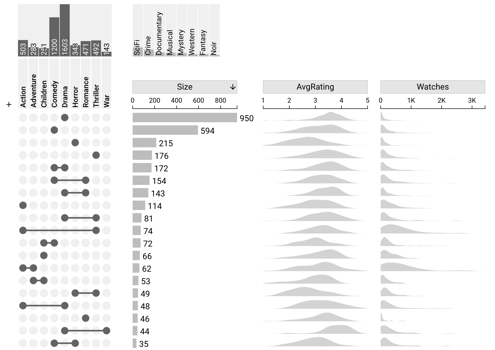

# Introduction

UpSet 2.0 is an interactive, web based visualization technique designed to analyze set-based data. UpSet visualizes both, set intersections and their properties, and the items (elements) in the dataset. UpSet 2.0 is available at [upset.multinet.app](https://upset.multinet.app) and also available as a modular [react component](https://www.npmjs.com/package/@visdesignlab/upset2-react).

For more information about UpSet and/or set visualization, visit [upset.app](https://upset.app).

#### Example of UpSet 2.0 with a dataset about movies:
