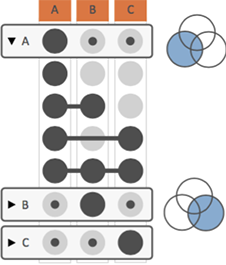
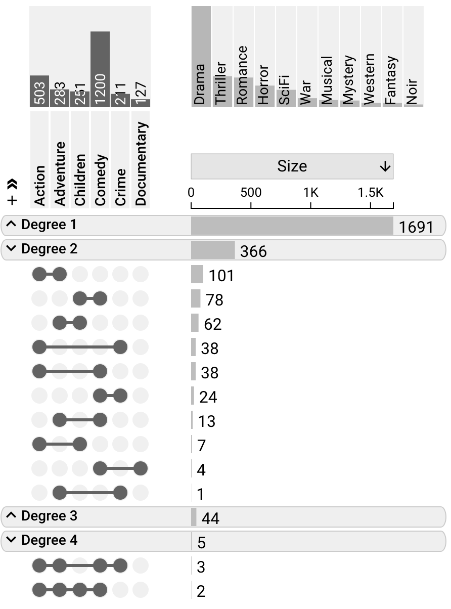
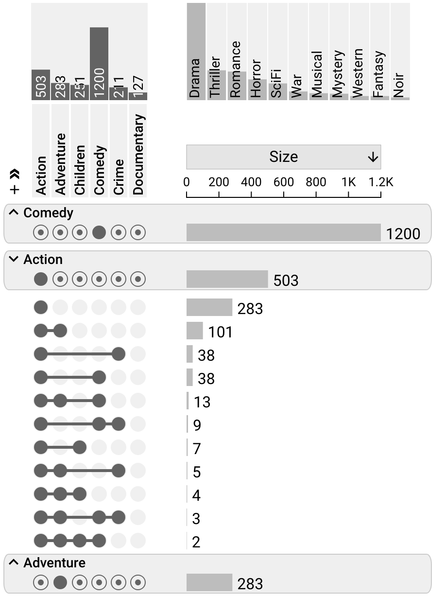
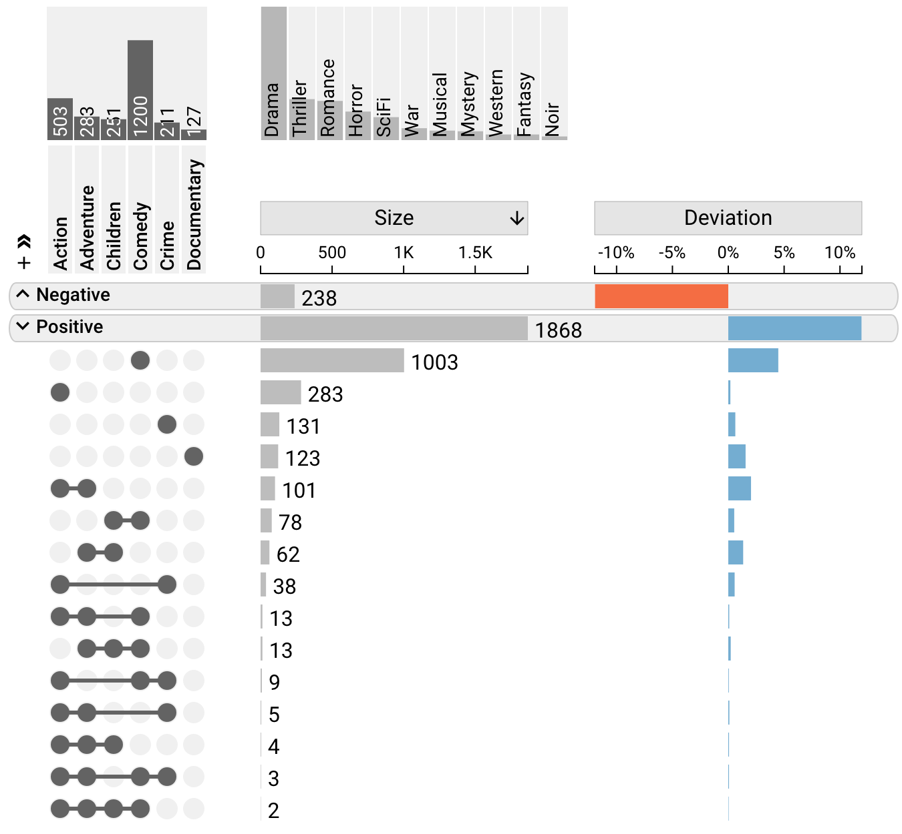
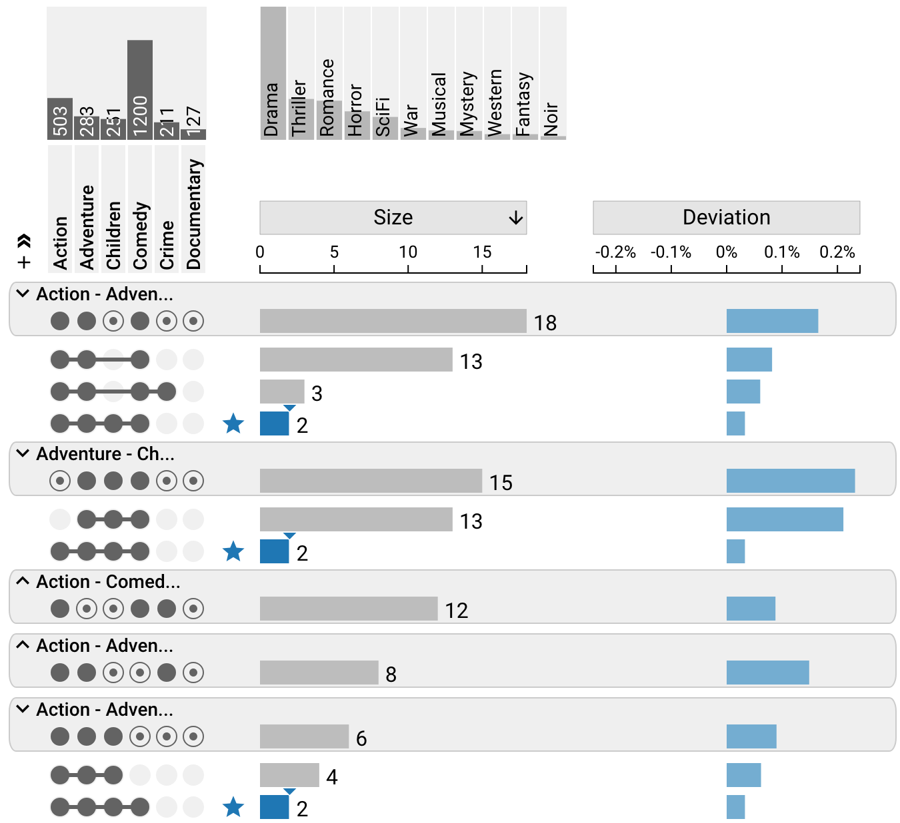
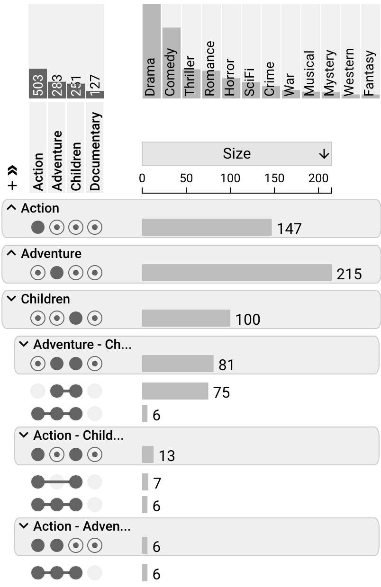

# Aggregation

In many cases, analysts are interested in understanding more complex set relationships than just individual intersections. UpSet 2 addresses this by making use of aggregations. Aggregations summarize multiple intersection that share a trait. The figure on the right shows an aggregation by sets: group all intersections that contain a set. Note the extra row labeled “A” - it summarizes all of the intersections where A participates, as shown in the corresponding Venn diagram. These aggregations can show data (size, attributes) just the same way as individual intersections can. Furthermore, aggregates can be collapsed, to hide the intersections that make up the aggregate, as is the case for B and C in the figure. Note that aggregations can result in intersections being contained in multiple aggregates.

> _*Note*_: Aggregation can only be selected by using the settings sidebar, but it can also be defined in the config

## Aggregation by Degree

 Aggregation by Degree organizes intersetions based on degree. This is an efficient method to inspect whether most items are part of none, one, two or more other sets.

 

## Aggregation by Sets

Aggregation by sets gives a nice overview of the properties of the set, and selectively un-collapsing which enables analysts to inspect the composition of individual sets.

## Aggregation by Deviation

Aggregation by deviation organizes the intersections into two aggregates, positive and negative deviation. This is useful for isolating intersections with specificly signed deviation.

## Aggregation by Overlaps

Aggregation by Overlap shows specific set combinations with a minimum degree specified in the sidebar. This view can be useful for finding high-order intersections which are present in mutiple relevant possible combinations. Every duplicate of a selected or bookmarked intersection is visibly highlighted, allowing for easy recognition of these duplicates.

## Nested Aggregation

Nested aggregation is an advanced approach that is most useful to see pairwise overlaps between sets. In the above screenshot, the first level of aggregation is sets, the second is overlaps (all intersections that overlap between two sets). Combined, this results in a view that lets analysts efficiently analyze which sets interact with each other.
