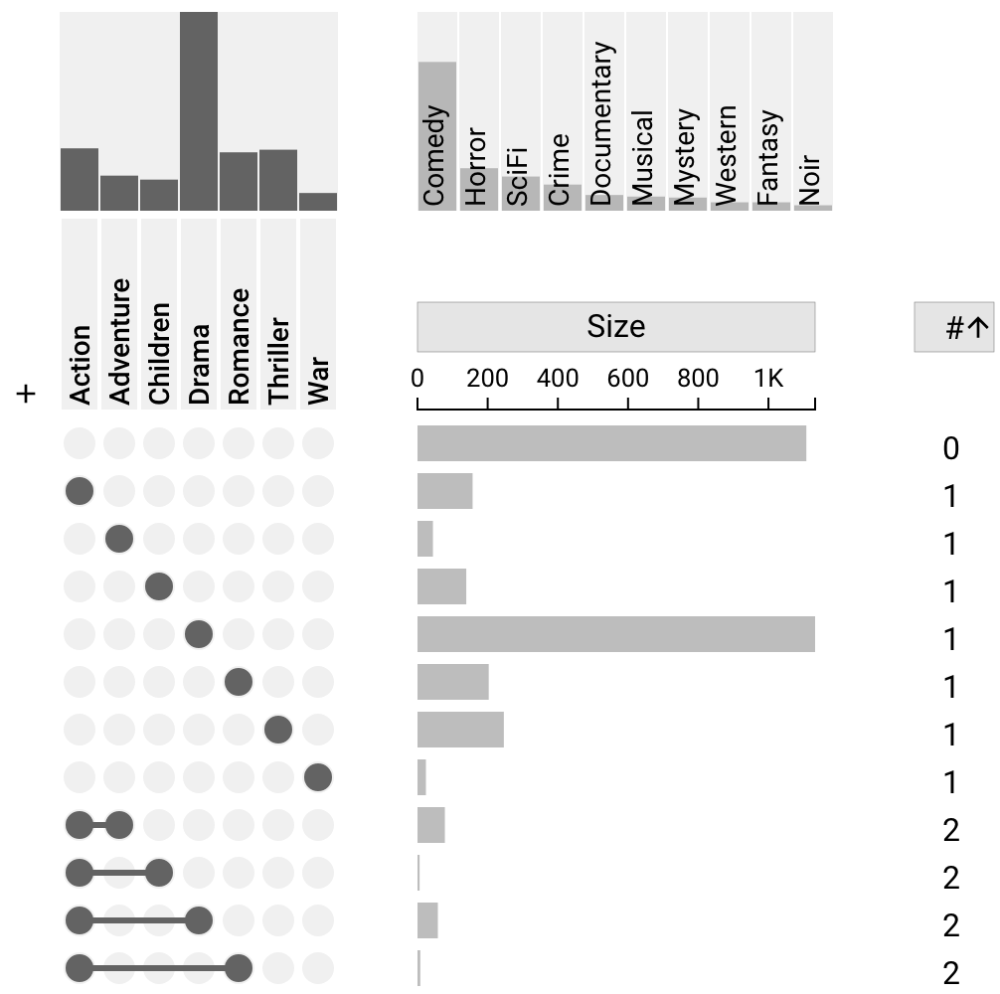
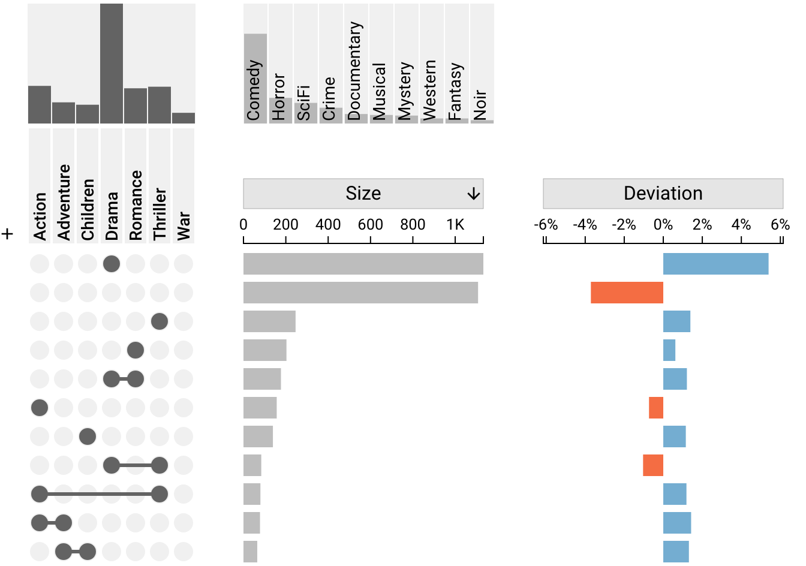

# Built-in / Derived Attributes

Derived attributes refer to Deviation and Degree. These two attributes are calculated based on the data provided, and are not provided explicitly by the user. These attributes can be enabled or disabled using the settings sidebar or the header of the column.

## Degree

Degree represents the number of overlaps present in a given intersection. The degree for a intersection which includes three sets would have a degree of 3. The "no-set" intersection has a degree of 0.

A plot can be sorted by degree or aggregated by degree. [Aggregation by degree](../aggregation#aggregation-by-degree) is an efficient method to inspect whether most items are part of none, one, two or more other sets. [Sorting by degree](../sorting-and-filtering#sort-by-degree) is an efficient method for linearly organizing the intersections by overlap count. Finally, degree can be used to [filter intersections](../sorting-and-filtering#filter-by-degree) within a specific range of overlaps.

Degree is visualized by a number which represents the degree of the intersection.

## Deviation

Deviation indicates how much an intersection deviates from the expected size if we assumed that set membership were random. This metric is useful for visualizing the "surpise" of a given intersection. For more information about deviation and how it is computed, see [Lex, 2014](https://vdl.sci.utah.edu/publications/2014_infovis_upset/). As with degree, a plot can be [sorted by deviation](../sorting-and-filtering#sort-by-deviation) and [aggregated by deviation](../aggregation#aggregation-by-deviation).

Deviation is visualized by a red/orange or blue bar indiciating the value of the deviation where red/orange represents negative, and blue represents positive.

