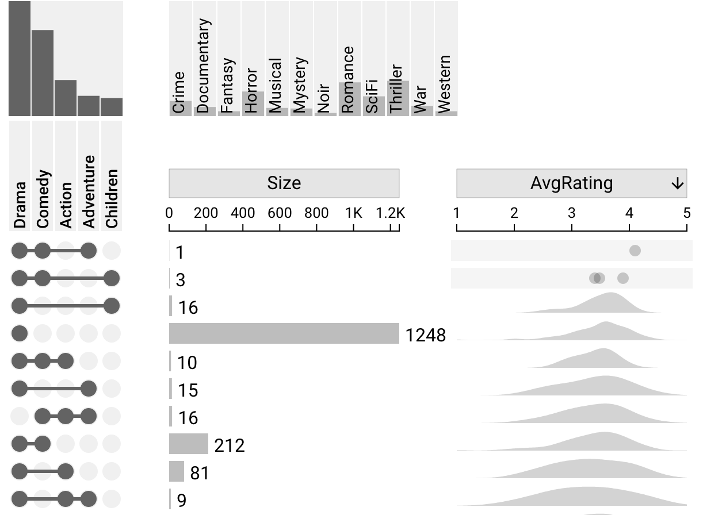
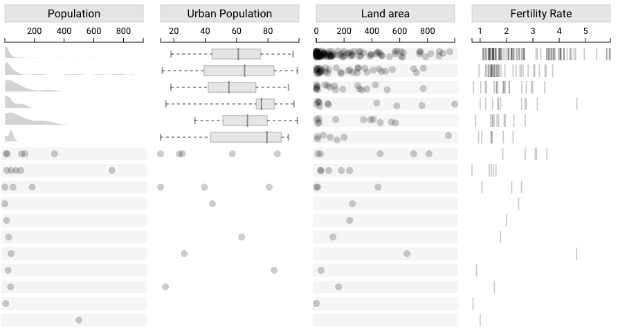

# Dataset Attributes

Attributes can be built into the dataset. These can be numeric or categorical. An example of a numeric field would be the average rating for a movie.

As with [derived attributes](built-in#built-in--derived-attributes), these attributes can be enabled or disabled using the settings sidebar or the attribute column headers. Additionally, the plot can be sorted by attributes. For more information on sorting, see [sorting by attributes](../sorting-and-filtering#sort-by-dataset-attribute). Unlike derived attributes, however, there is no aggregation option for dataset attributes.

@

## Numeric Attributes

Numeric attributes can be visualized using density plots, box-and-whisker plots, jittered dot plots, or strip plots. Right-clicking the column header for the attribute allows changing the plot type for that attribute. For any intersection with five or fewer times, a dot plot is always used.

## Categorical Attributes

Categorical attributes are visualized with stacked bar charts. The size of each stacked bar in each intersection corresponds with the number of elements that fall into the category represented by that bar in that intersection. Upset uses a palette of seven colors to represent categories in stacked bars. Each color is consistent between intersections but not between different attributes in different columns. For example, if yellow represents *North America* for the attribute *Continent*, it will represent *North America* in the *Continent* column for all intersections. However, in the *Region 1* column, yellow will represent a different category.

If there are more than seven categories for an attribute, Upset uses alternating black and grey colors to represent these extra categories. These two colors are intersection-specific and always alternate according to the order of categories in that intersection, so a category shown as black in one row may be shown as grey in a different row.

Hovering over a stacked bar shows a tooltip with the category that the bar represents and the size of that category in that intersection.

