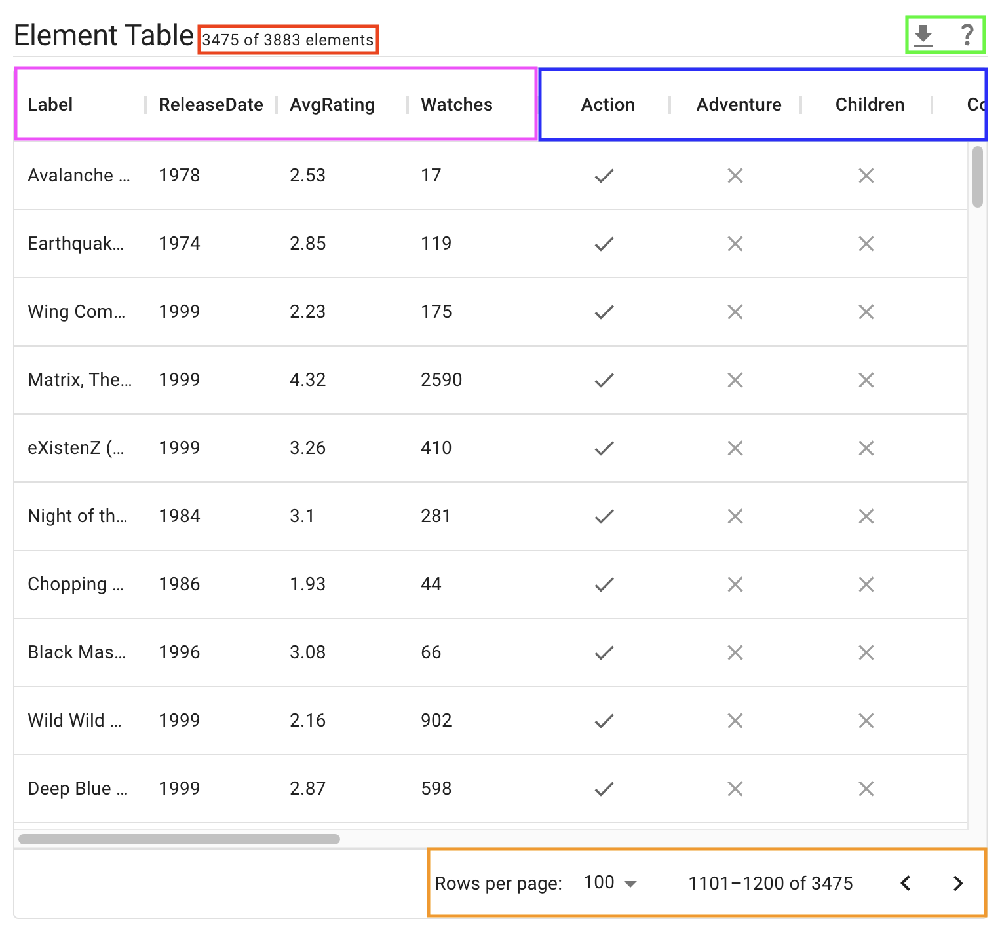

# Element Table

The element table appears at the bottom of the element view, displaying a list of all elements from the active selection and their attributes. For **explicit and graphical selections**, it shows all elements from visible intersections which fall within the bounds of the selection. For **intersection selections**, it shows all elements in the selected intersection. If no selection is active, all visible elements are shown.

The **subtitle**, in red, shows both the number of elements displayed in the table (on the left) and the total number of elements in the dataset (regardless of whether they're visible; this number does not change after data has been uploaded). 

The **download button** in the green box (to the left) allows downloading the elements currently displayed in the table as a CSV; mousing over the question mark to the right of this displays a tooltip describing what the table currently displays. 

The **attribute columns**, boxed in pink, show attributes and their value for each element. 

The **set membership columns**, boxed in blue, indicate which sets each element belongs to, with a check indicating inclusion in that column's set and an X indicating exclusion. 

The **pagination controls**, in orange: set the number of intersections per page (on the left), indicate the indexes of elements on the current page out of the total currently displayed by the table (in the middle), and paginate forward and backwards (buttons on the right).