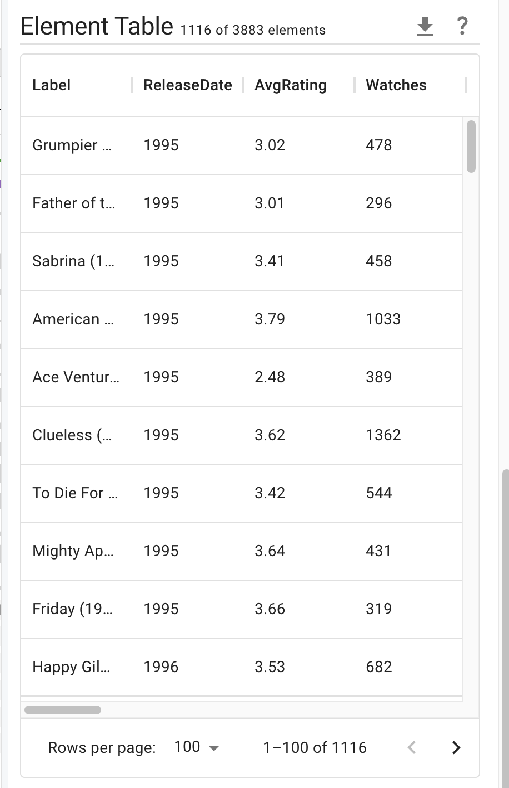

# Element View Sidebar

The element view sidebar allows for intersection-wise and attribute-wise interactive analysis of dataset elements.

## Components

The sidebar header contains 2 extra icons (in addition to the default close and expand icons). 
The leftmost allows for adding new plots to the sidebar; see [Adding Plots](./plots/add-plot.md). 
The second from the left opens the explicit query interface just below the header; see [Selections](./selections/index.md).

Below the header (and the explicit query interface, if open) are the bookmark & selection chips, which show selections and bookmarked rows; see [Selection Chips](./selections/index.md#selection-chips).
If no selections or bookmarks exist, a blue notice will appear here instead.

Below the selection chips are the plots, which also may be empty. By default, the plots consist of a histogram for each numeric attribute in the dataset. See [Plots](./plots/index.md).

Below the plots is the element table, which shows either all elements or elements from the current selection if one is active; see [Element Table](./element-table.md).

import DocCardList from '@theme/DocCardList';

<DocCardList />
