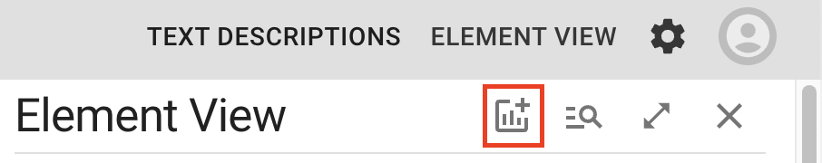
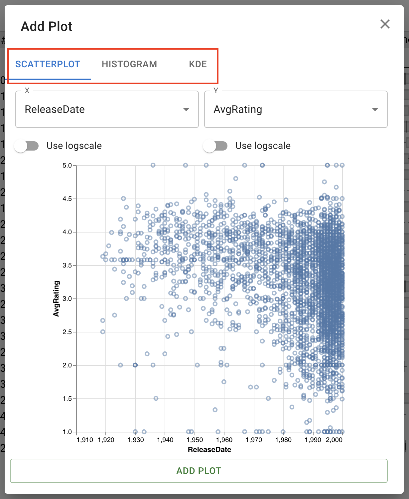
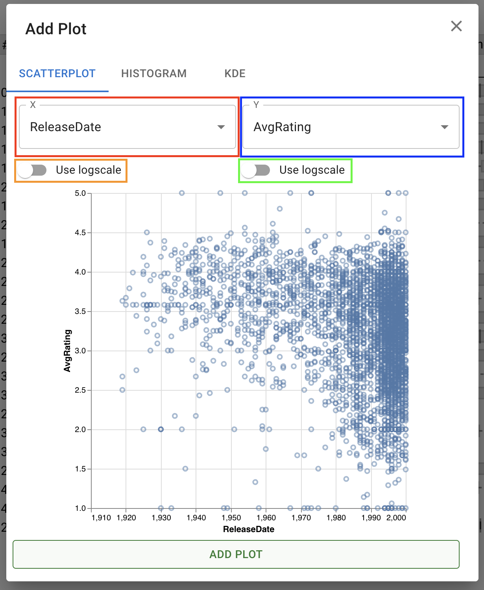
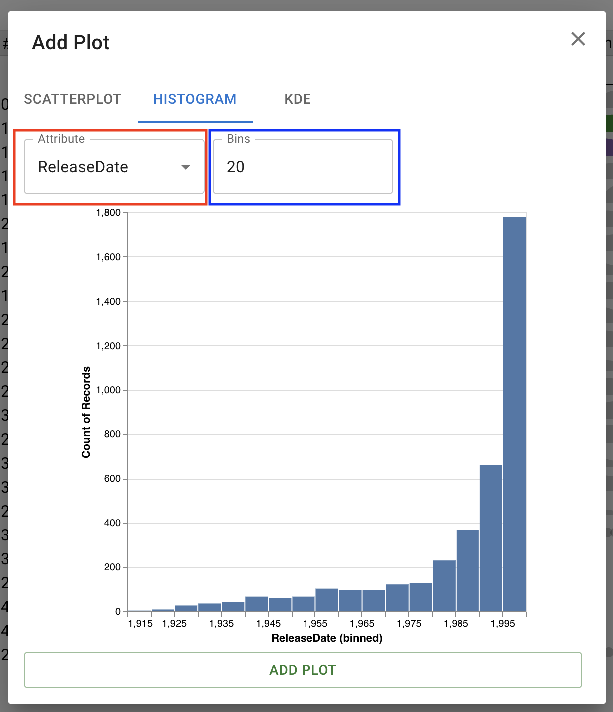
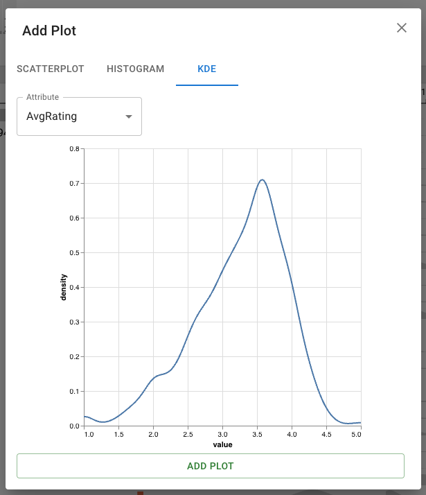

# Adding Plots

By default, you'll see a bar chart for each numeric attribute in your dataset. However, you can add as many plots to the sidebar as you'd like. To add a plot, click the **Add Plot** button to open the add plot dialog:

Within this dialog, the 3 tabs on the top allow you to choose which type of plot you'd like to add:

For details on each plot type, see: [Scatterplot](./scatterplot.md), [Histogram](./histogram.md), and [KDE](./kde.md).

## Adding a Scatterplot

Within the scatterplot tab, you have options to set the X and Y axis of the scatterplot: 

The **X** dropdown, boxed in red, sets the attribute to be used for the X axis of the chart. The **Use logscale** toggle underneath this, boxed in orange, activates logarithmic scale for the x axis and its attribute. The **Y** dropdown (blue) and its **Use logscale** toggle (green) function in exactly the same way, setting the attribute to use for the Y axis and toggling between a linear and logarithmic scale.

## Adding a Histogram

Within the histogram tab, you have options to set the X axis and the bin count of the histogram:

The **Attribute** dropdown, in red, sets the attribute to visualize along the X axis of the histogram. The bin count, in blue, sets the number of bins (bars) to show in the resulting plot.

# Adding a Kernel Density Estimate (KDE) Plot

Within the KDE tab, you can add a Kernel Density Estimate plot. The single dropdown controls the attribute visualized in the KDE.

