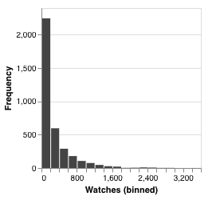
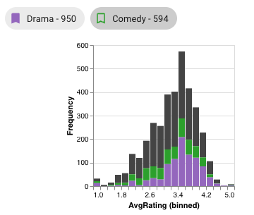

# Histogram

Histograms take all values for a particular attribute (from elements in visible intersections), sort them into bins, 
then display how many elements fall into each bin. The number of bins is defined while creating the histogram and defaults to 20.

For example, in this histogram of movie watches, we can see that there are over 2,000 movies with watch counts between 0 and 200,
with the number of movies in each bin falling drastically as watch counts increase.

## Colored Bars

When intersections are bookmarked or selected, colored bars are overlaid on each histogram for each selected/bookmarked intersection.
These bars display the number of elements from the corresponding intersection that fit into that bin.

In this example, two intersections have colors, so two extra bars appear in this histogram. From these bars,
we can see that elements (movies) in the *Comedy* intersection generally matches the rating trend of the overall dataset (in grey),
whereas there are few or no elements in the *Drama* intersection with ratings between 2.2 and 2.4.

## Selections

Selections add their own bars to histograms; see [Histogram Selection](../selections/graphical.md#histogram).