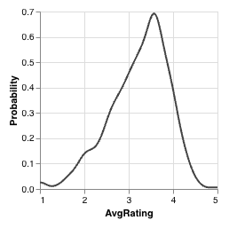

# Kernel Density Estimate (KDE)

Kernel Density Estimate Plots (also known as density plots or KDEs) show the [probability density function](https://en.wikipedia.org/wiki/Probability_density_function) for a given attribute.
These plots use all attribute values from elements in visible intersections to produce a [kernel density estimate](https://en.wikipedia.org/wiki/Kernel_density_estimation) for this attribute.

## Colored Density Estimates

When intersections are selected or bookmarked, additional colored lines are added to each KDE for each selected/bookmarked intersection.
These lines represent a density estimate of attribute values exclusively from elements in the corresponding intersection.

In this example, two intersections have colors, so two extra density lines appear in the plot.
From these lines, we can see that elements (movies) from the *Drama* intersection are much more likely to ratings between 3 and 4,
whereas elements from the *Comedy* intersection are more evenly distributed and better match the overall dataset (in grey).

## Selections

Selections add an additional line to KDEs; see [KDE Selections](../selections/graphical.md#kde)