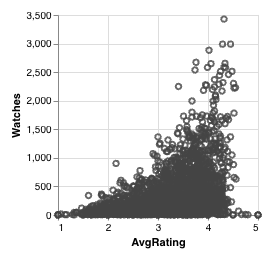
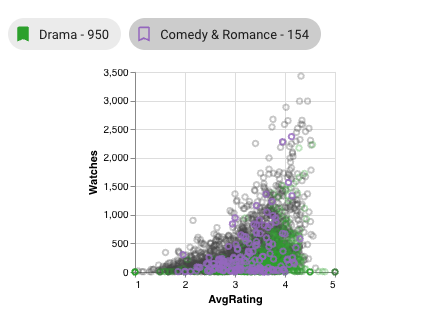

# Scatterplot

Scatterplots plot all elements in the visible intersections along two user-defined attribute axis.
Each *(x, y)* point represents an element which has a value of *x* for the attribute plotted on the x-axis and 
a value of *y* for the attribute plotted on the y-axis.

This allows you to see how attributes correlate in the dataset. For example, this scatterplot shows some correlation
between watch count and average rating on a dataset of movies. The watch count generally increases with the average rating
until watches dramatically decrease for movies rated >4.5.

## Colored Points

If the intersection that a point belongs to is bookmarked or selected, it takes on the intersection's color.
Points not in a selected or bookmarked intersection remain the default grey color.

In this example, the *Drama* intersection is bookmarked and the *Comedy & Romance* intersection is selected.
*Drama* is much larger, so you see more points colored green, with a smaller number of purple points from *Drama* in the foreground.

## Translucent Points

When an intersection is selected, all points **not** in the selected intersection become translucent, while the points 
from the selected intersection remain opaque (in addition to gaining the color of the intersection).

## Point Z Ordering

When points overlap, points from the selected intersection are ordered on top (fully visible), then points from bookmarked intersections
in the middle, then all other points. In other words, selected points are never obscured and bookmarked points cannot be
obscured by unbookmarked points (but may be by selected or other bookmarked points).

## Selections

Graphical selections can also affect the color, opacity, and ordering of points; see [Scatterplot Selection](../selections/graphical.md#scatterplot). Explicit selections do not affect element view plots.