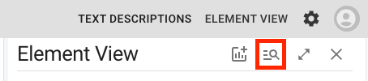
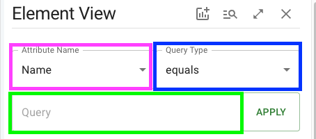

# Explicit Selections

Explicit element selections query elements by a single attribute by checking whether each element's matches a query string; if a match is found, the element is considered part of the query. The technique for matching is selected when creating a query. For queries on numeric attributes, *less than*, *greater than*, and *equals* can be used to compare elements to the query string. For queries on textual (string) attributes, Upset 2.0 provides *equals*, *contains*, *length equals*, *less than*, *greater than*, and *regex* query types.

## Creating an explicit selection

To show the interface for creating an explicit element selection, click the button in the header of the element view:

This opens the explicit selection interface, which has 3 fields:

The **Attribute** dropdown, boxed in pink, selects the attribute to be used to determine element inclusion. The **Query Type** dropdown, in blue, determines the comparison type to compare attribute values to the **Query**, in green. The **Apply Button** saves & activates the selection. While a selection is saved (and regardless of whether it's active), the apply button turns into a red **Clear Button** which deletes the saved selection and allows entry of a new selection.

## Query Types

An element is counted as being part of the explicit selection if its attribute value for the selected attribute matches the query string. Whether a value matches the query is determined by the query type and the attribute type, detailed below:

### Equals

Useable for both numeric and string attributes.
For **string** attributes, the attribute value must exactly equal the query string (including casing, whitespace, and diacritics) to match. For **numeric** attributes, value must be equal to query within 4 decimal places.

### Less Than and Greater Than

Useable for both numeric and string attributes.

For **string attributes**, the attribute value must occur **before** the query string in alphabetical order to match a **less than** selection and **after** the query string to match a **greater than** selection. This alphabetical ordering is case-sensitive and not limited to the english alphabet, with numbers coming before lowercase letters coming before uppercase letters: `1 < a`, `a < A`, etc. This comparison is compatible with all UTF-8 characters, including diacritics, and the ordering is handled according to the language settings of the browser in use. 

For **numeric attributes**, the two values are converted to strings, then compared as string attributes. Practically, this functions as numeric `<` and `>` operations, where attribute values are included in *less than* queries if the attribute value is less than the numeric value of the query string, and vice versa for *greater than* queries.

Internally, `localCompare` is used to determine order with, the attribute value as the `referenceString` (AKA `this`) and the query string as the `compareString`. See [the localCompare docs](https://developer.mozilla.org/en-US/docs/Web/JavaScript/Reference/Global_Objects/String/localeCompare) for details.

### Contains

Useable only for string attributes. An attribute value matches the selection if it contains the query string as a substring; the value is also counted as included if it equals the query string. This is case, whitespace, and diacritic-sensitive.

### Length Equals

Useable only for string attributes. The query string should be an integer, and an attribute value matches the selection if its character count (including whitespace) equals the integer query string.

### Regex

Useable only for string attributes. The query string should be a [regular expression](https://en.wikipedia.org/wiki/Regular_expression), and matching is determined by the rules of regular expressions, where the query string is the regular expression and the attribute value is tested for a match.