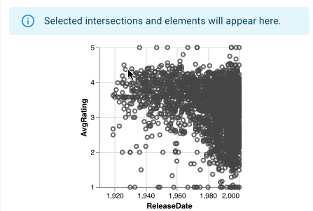
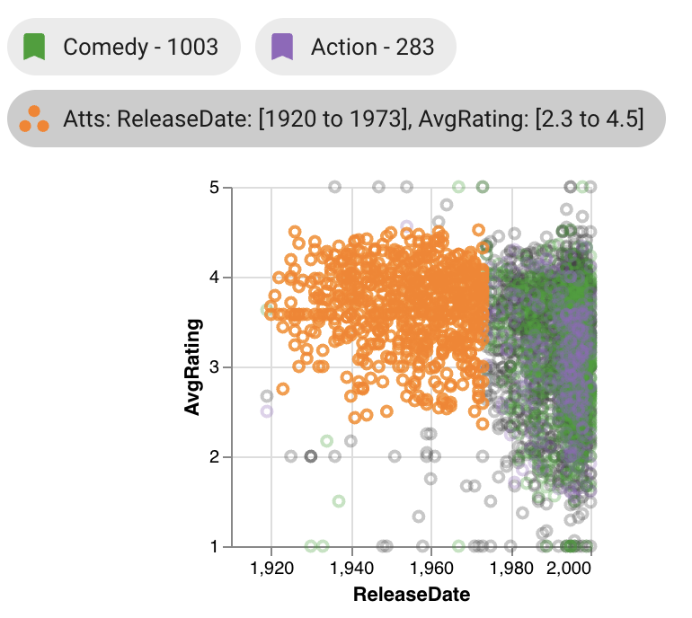
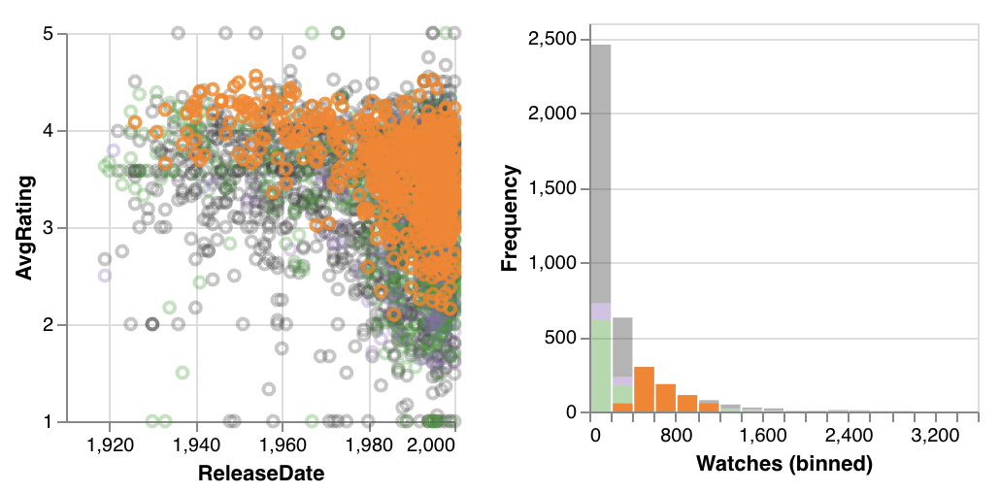
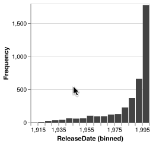
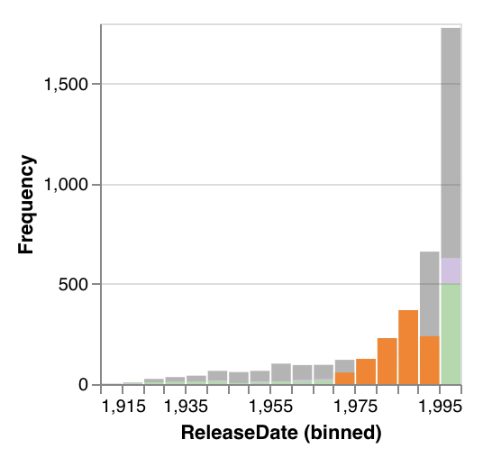
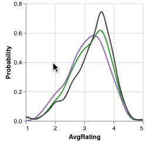

# Graphical Selection

Graphical selections are defined by ranges of attribute values created by dragging over plots in the element view; an element is considered part of a selection if the element's attribute value(s) falls within the range defined by the selection. Selections may define value ranges for one (if created by a histogram or KDE) or two (if created by a scatterplot) attributes; elements must fall within both attribute ranges for 2D selections.

**Selections are linked between all plots.** If a selection is made in one plot, the other plots display their selection indicators as though a selection was made on them directly. Regardless of the graphical selection's origin plot, all plots visualize the selection by filtering all elements in visual intersections through the selection parameters (attribute value range(s)) and displaying the result in an orange color.

## Scatterplot

Selections created by scatterplots are two-dimensional over the 2 attribute axis of the scatterplot; both of an element's attribute values must fall within the ranges defined for a two-dimensional selection for the element to be considered part of the selection.

Scatterplots show that elements lie within the current graphical selection by coloring the corresponding point orange. Additionally, while a graphical selection exists, elements not within the selection become translucent. Bookmark and intersection selection colors remain for deselected elements, but the orange selection color overrides the intersection color.

When displaying a selection from a different plot, points that fall within the selection still are colored orange, however, these linked selection points may not be continuous as selections made directly on the scatterplot are.

## Histogram

Selections created by histograms are 1-dimensional over the attribute on the x axis of the histogram. For an element to fall within this selection, its value for this attribute must fall within the selected range. 

Histograms show the distribution of selected elements with partial bars overlaying the existing bars. The selection bars use the same bin count, but not all bins will necessarily have selected elements. While a selection exists, all non-selection bars become translucent.

## KDE

KDE plots show selections as an orange line representing the probability density function of selected elements from all visible intersections. If the selection bounds do not encompass the entirety of the KDE's x-axis, the selection line may not span the width of the entire plot. The line for all visible elements (grey) and the lines for bookmarked and selected intersections remain during a selection but become translucent.

