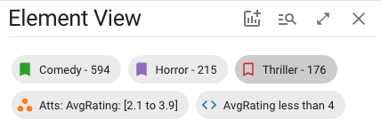
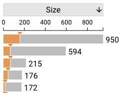
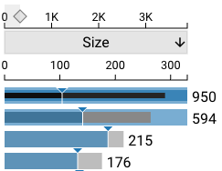
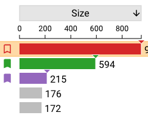
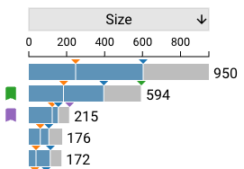
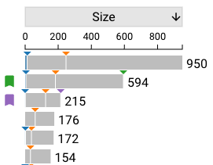

# Selections

Selections are user interactions which show specific subsets of data, both in the intersection size bars and in the element view plots.

## Selection Types

There are 3 types of selections: [Intersection](./intersection.md), [Graphical](./graphical.md), and [Queries](./query.md). 
Only one selection type is active at a time, though inactive selections still affect specific areas of the plot.

## Selection Chips

At the top of the element view, a series of selection chips show the current bookmarks and selections. The active selection
takes a darker background than the rest of the chips. Any number of bookmark chips may be shown, with no limit on the number
of bookmarks defined in the plot. Only one unbookmarked selected intersection may be shown. Similarly, only the single
graphical selection and element query will be shown; these cannot be duplicated or bookmarked. 

Clicking any chip will toggle its status as the active selection.
The bookmark icon on the chips representing intersections can be used to toggle their bookmark status. 
These chips disappear as soon as the corresponding intersection is no longer selected or bookmarked.
Chips representing graphical and element queries cannot be removed by interacting with them; these are only deleted
when the selection is cleared via its corresponding interface.

## Selection Size Bars

Whether graphical, query, or intersectional, the active selection appears in the size bars of all intersections
that contain elements which match the selection parameters. **Graphical and query** selections show a partial size bar
representing the number of elements in the intersection matching these parameters, colored blue (for query) or orange (for graphical):

If the advanced scale is active, these selection size bars wrap into the nested bars:

**The selected intersection & bookmarks** have their size bars filled in with their bookmark color if the active selection
is an intersection:

### Selection Ticks

All selections, regardless of their active state, are displayed on the size bars with colored ticks; the active
selection has a tick (matching the selection color) at the end of its partial (or full, for intersectional) size bar.
Since these ticks persist, they allow size comparisons between different selection types on an intersection-by-intersection basis.

The example above shows an active element query with an inactive graphical selection and 2 bookmarked intersections. 
The graphical selection is smaller than the element query in all size bars, indicated by the orange graphical ticks
left of the blue query ticks. The two bookmarked intersections have 3 ticks, with the third tick matching their bookmark color.

If a selection matches no elements in an intersection, the tick for that selection does not appear in the size bar:

In this example, the 4th and 6th intersections have no elements matching the element query, but all have elements
matching the graphical selection.