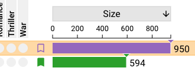
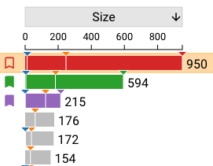

# Intersection Selection

Intersection selections occur in the intersection rows. An intersection can be selected by clicking on its row (shown by a yellow highlight)
and bookmarked by clicking the empty bookmark icon. 

.

A bookmarked intersection is shown with a filled-in bookmark icon, and this icon persists regardless of whether it's selected. 
Clicking the filled-in bookmark icon unbookmarks the intersection. 
When an intersection selection is active, all bookmarked and selected rows have their size bars filled in with their color, 
and colors from the other two selection types are not shown in the size bars.

Intersection selections and bookmarks add colors to the element view plots; 
see how this works for [scatterplots](../plots/scatterplot.md#colored-points), 
[histograms](../plots/histogram.md#colored-bars), and [KDEs](../plots/kde.md#colored-density-estimates).