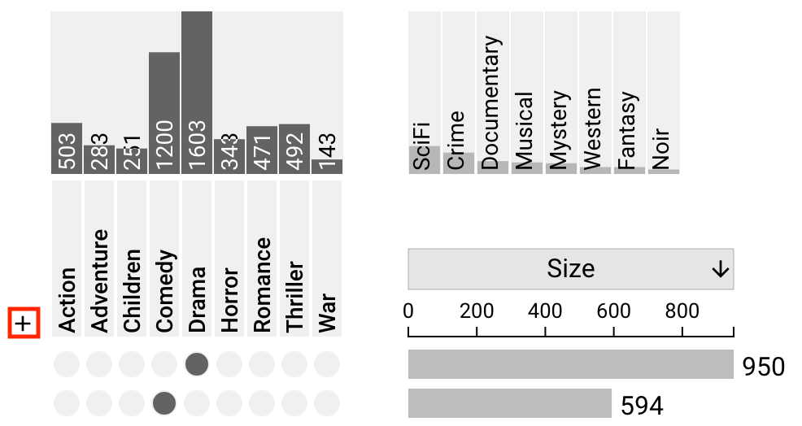
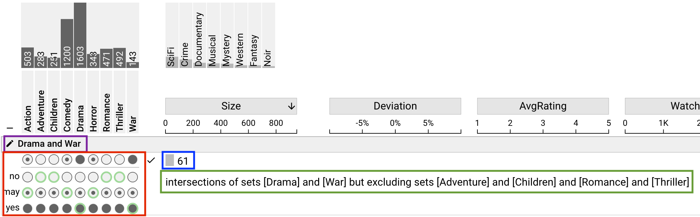
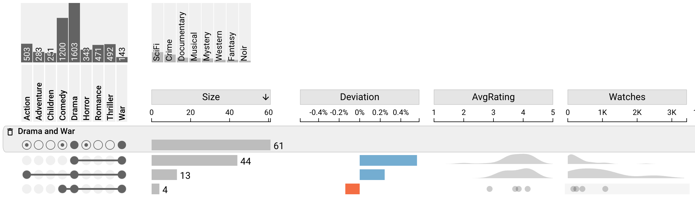

# Query By Sets

The Query by Sets interface allows the user to specify specific sets to include or exclude from the current UpSet plot. While this is possible with the addition/removal of visible and hidden sets, the query by sets interface allows a more refined selection.

## Opening the Interface

To open the interface, simply click the plus icon next to the set matrix.

## Creating a Query

Once the interface is open, the user can create a specific query by choosing intersection constraints and renaming the query. They will also see a preview of the total result size and a description of the current query parameters.

### Set Matrix Selection

Within the interface, there are three rows of possible query selections, where each column represents the appropriate set. The (mutually exclusive) options are: "No", "May", and "Yes". By default, all columns are set to "May".

The "No" column indicates that the set should be *excluded*, meaning that all resulting intersections *must not* include this set.

The "Yes" column indicates the opposite, that all resulting intersections *must* include this set.

The "May" column indicates that the set may or may not be included. Any intersections that contain this set and satisfy all other query constraints will be included in the results.

The top row of the matrix indicates the current selection.

### Renaming the Query

To rename the query, simply click the edit icon in the query header bar.

### Result Size Preview

The size of the resulting query is shown as a sizebar that is consistent with the rest of the UpSet interface. This shows the *total* number of elements present in the query.

### Query Description

The query description shows a textual description of the current set query. This is a useful way to understand how the current parameters will affect the resultant intersections.

## Query Result

Once a query has been made and "Add Query" has been selected, the UpSet plot will dynamically shift to show the resulting intersections of that query.

The header row of the plot will now show the query title ([set previously](#renaming-the-query)), the query parameter matrix, the total size of the query, and a delete icon.

The new populated intersections *only* show the set intersections which match the parameters defined in the [set matrix selection](#set-matrix-selection). In this above example, there are only three subsets of Drama & War movies: Just Drama & War; Action, Drama, & War; and Comedy, Drama, & War.

Note that all intersections match the query parameter that they *must* contain Drama and War.
