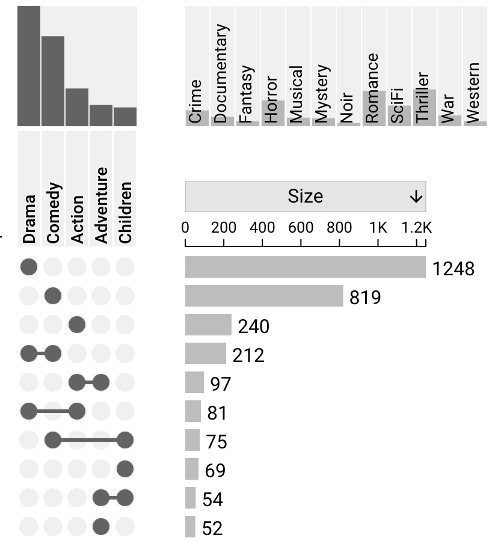
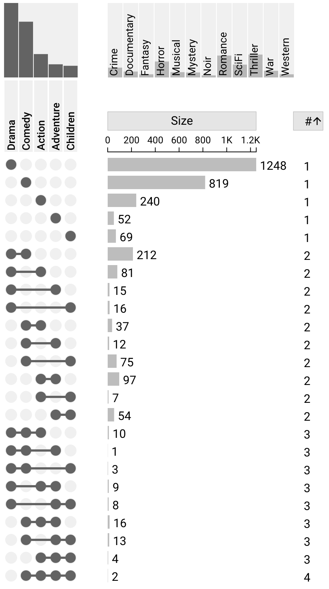
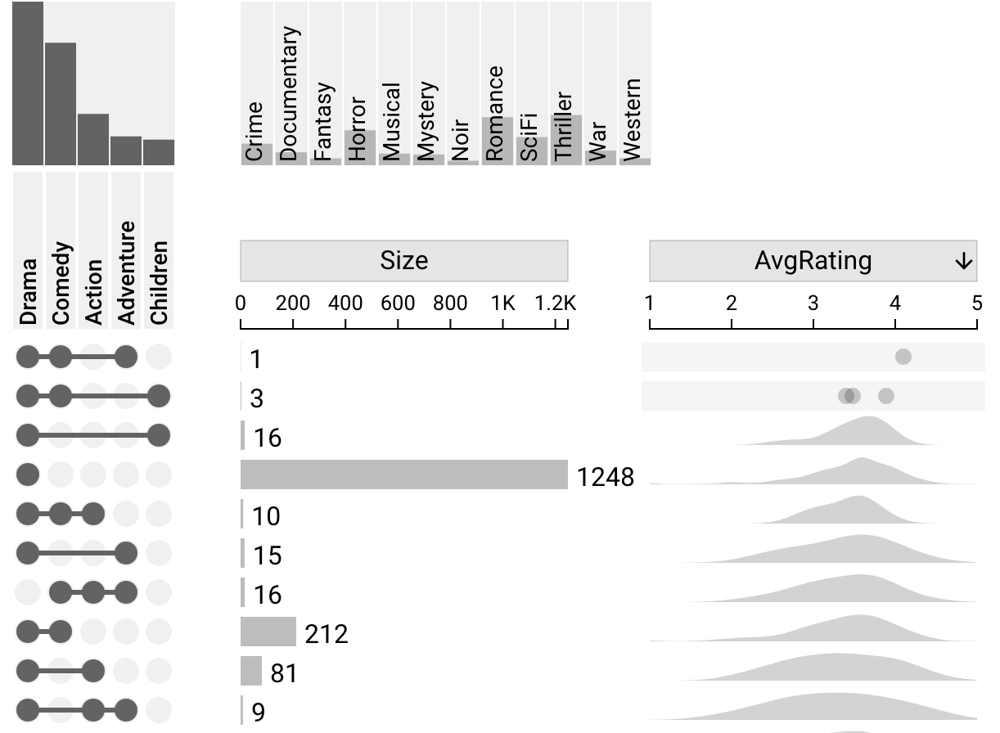
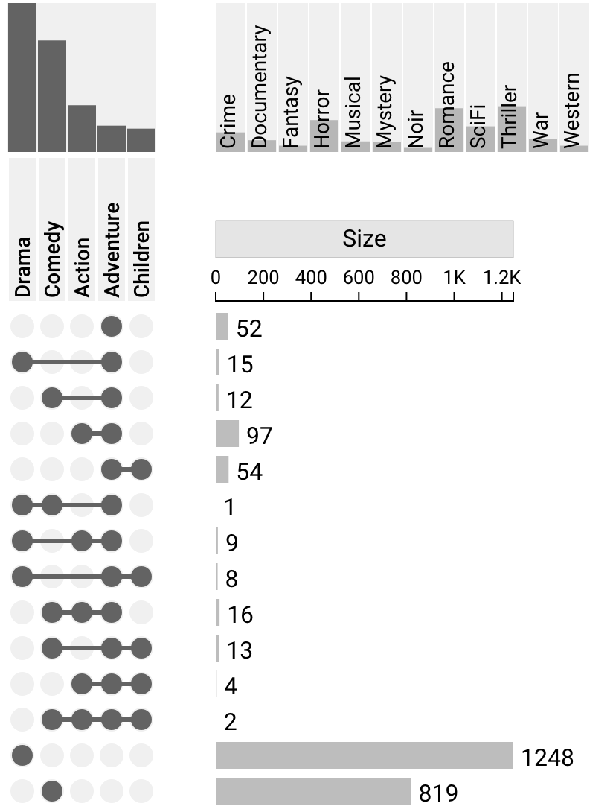
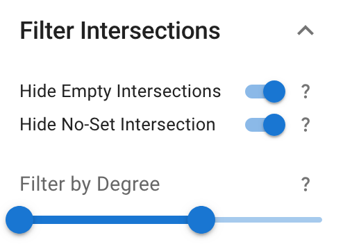
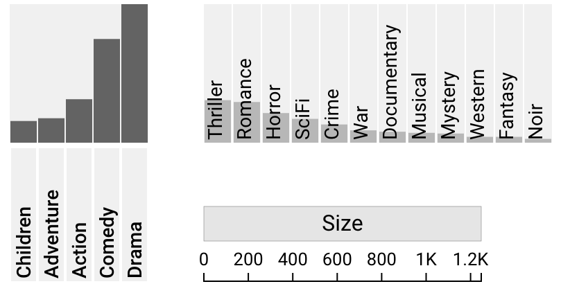

# Sorting and Filtering

UpSet 2 supports multiple different types of intersection sorting, as well as visible and hidden set sorting. Additionally, there are three methods for filtering intersections, not including set queries (see [Query By Set](./query-by-sets.md)).

## Intersection Sorting

The following methods all alter the ordering of the intersections within an UpSet plot.

### Sort By Size, Degree, Deviation

It is possible to sort in ascending or descending order by the size, degree, or deviation of an UpSet plot. Sorting by any of these attributes simply sorts by comparing the numeric values of the intersections.

Example plot of Movies sorted by size in descending order:

#### Sort by Degree

Sorting by degree compares values of the degree of the intersections. When the values are the same, the ordering of the visible sets has an effect on the ordering of the intersections. The matrix will always be ordered from left to right for intersections with the same degree.

Example plot of Movies sorted by degree in ascending ordeer:

#### Sort by Deviation

Sorting by deviation simply compares values of deviation of the intersections. This can be useful for visualizing which intersections are most of least surprising.

### Sort By Dataset Attribute

It is also possible to sort by a user-defined dataset attribute in ascending or descending order. For more information on attributes, see: [Dataset Attributes](./attributes/dataset.md).

Since these attributes have pre-computed statistical information, all sorting is done by comparing the *mean* of each intersection.

Example plot of Movies sorted by Average Rating in descending order:

### Sort By Set

Additionally, it is possible to sort the intersections by a given set, where that set is always sorted at the top of the intersections matrix. All intersections which contain this set will be sorted by degree - ascending amongst eachother. The rest of the intersections are then also sorted by degree - ascending, excluding the intersections which include the selected set.

To select this option, either left click the visible set column, or right click the set and choose `Bring Set: {setname} to top`.

Example plot of Movies sorted by Set: Adventure:

## Intersection Filtering

UpSet 2 supports three main types of intersection filtering which are accessible via the filtering dropdown in the settings sidebar, shown below.

### Filter By Degree

In the "Filter Intersections" section of the left sidebar, you can use a slider to filter intersections by maximum and minimum degree (for more information on degree, see [Built-In Attributes](./attributes/built-in.md)). Both ends of this slider are inclusive; if set to 3-6, intersections with degrees 3 and 6 will be shown.

### Hide/show the No-Set Intersection and Empty Intersections

In addition to the degree slider, the "Filter Intersections" section of the left sidebar has two toggles for the No-Set Intersection and Empty Intersections. The No-Set intersection contains all elements that are not part of the visible sets; these elements may be members of one or more hidden set(s), or may not be part of any set. Empty intersections are combinations of sets that do not occur in any element in the dataset, hence their size is 0.

## Set Sorting

By right clicking on the visible or hidden sets within the plot, it is possible to sort ONLY the relevant sets by Alphabetical, Ascending (size), or Descending (size). This generally does not affect the order of the intersections, but when the intersections are sorted by degree or by a set, the order of the visible sets can change the ordering of the intersections.

Example plot of Movies where visible sets are sorted by size ascending, and hidden sets are sorted by size descending:

