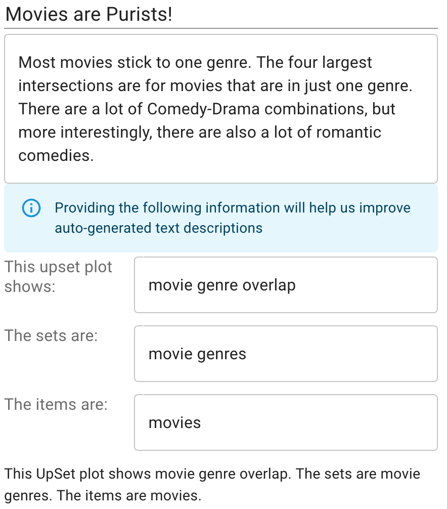

# Text Description Sidebar

The text description sidebar allows the user to see auto-generated or user defined text descriptions for the current UpSet plot configuration as well as a user-defined title and caption for the plot.

## Text Description

 By default, the sidebar will show the *generated* text description. This will be re-generated when relevant changes occur in the plot.

> __*Note*__: Not all chart configurations are currently supported by the text description generator.

For more information on how the text description is generated, see [McNutt 2025](https://vdl.sci.utah.edu/publications/2025_eurovis_text-descriptions/).

There are two states for the text description, *short description* and *long description*. The user can toggle between these two states using the sidebar. The short description is meant to be a brief overview for the plot which should generally be no longer than a paragraph. The long description is a markdown-formatted long-form text block which provides detailed information on the plot, dataset, statistics, and more.

Additionally, the user can define the text description by [Editing the Text Description](#editing-the-text-description). This will pause any automatic updates to the generated description when the plot updates.

### Editing the Text Description

Often, it is necessarry to make changes to the generated text description in order to add contextual information or for other reasons. To do this, the user can edit the generated text description via the sidebar.

> __*Note*__: Once the user has defined their own version of the text description, the text will __no longer__ update when the plot configuration changes.

The short description and long description can be separately edited and both will save separately.

## Caption and Title

The text description sidebar also allows the user to add plot information such as title, caption, and dataset information. The dataset information is used by the text description generator to help improve grammar and description relevancy.

Result of the above edit (shown below):

